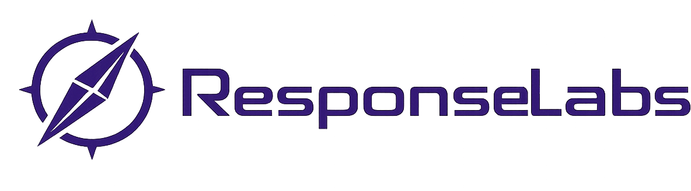

# ResponseLabs
> ***Un studio de création de startups logicielles***

>> Nous regroupons des développeurs et créateurs pour lancer rapidement des projets, 
>> mesurer leur potentiel réel, et ne garder que ceux qui fonctionnent.

# Le modèle
## Notre aproche

- Cycles courts, décisions basées sur des données réèles
- Abandon rapide des projets non viables

> ResponseLabs ne propose aucune rémunération immédiate. 
> Nous construisons d’abord des produits. 
> La valeur vient ensuite.

## Notre philosophie
- Pas de bullshit
- Pas de projets zombies
- Pas de hiérarchie lourde

## Notre objectif
> Créer plusieurs startups, conserver les meilleurs, générer de la valeur réèle.

# À qui s'adresse ResponseLabs ?
## ResponseLabs est fait pour toi si:
- Tu sais livrer en production
- Tu comprends les enjeux buisness, pas juste techniques
- Tu préfères créer quelque choses plutôt que "faire des tickets"

## Ce n'est pas pour toi si:
- Tu cherches un job salarié classique
- Tu veux un cadre rigide et rassurant
- Tu n'acceptes pas l'échec rapide

# Ce que les membres gagnent
## Ce que nous offrons
- Participation aux projets (equity / parts / revenus - à définir selon le projet)
- Liberté technique
- Apprentissage accéléré
- Réseau de créateurs

## Ce que nous attendons
- Engagement réel
- Niveau technique solide
- Responsabilité

-------

> Vous voulez construir avec nous ? Rejoignez nous !.
