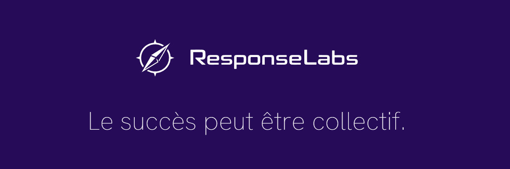
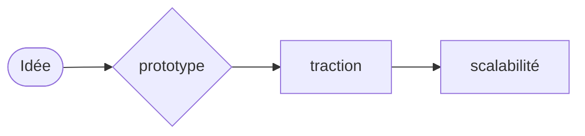

# Response Labs

> **Un laboratoire de création de startups**

Nous regroupons des développeurs et créateurs pour lancer rapidement des projets, mesurer leur potentiel réel, et ne garder que ceux qui fonctionnent.

---

## Le modèle

### Notre approche

**Principes clés :**
- Cycles courts, décisions basées sur des données réelles
- Abandon rapide des projets non viables

> **Important :** Response Labs ne propose aucune rémunération immédiate. Nous construisons d'abord des produits. La valeur vient ensuite.

### Notre philosophie

- Pas de bullshit
- Pas de projets zombies
- Pas de hiérarchie lourde

### Notre objectif

> Créer plusieurs startups, conserver les meilleurs, générer de la valeur réelle.

---

## À qui s'adresse Response Labs ?

### Response Labs est fait pour toi si :

- Tu sais livrer en production
- Tu comprends les enjeux business, pas juste techniques
- Tu préfères créer quelque chose plutôt que "faire des tickets"

### Ce n'est pas pour toi si :

- Tu cherches un job salarié classique
- Tu veux un cadre rigide et rassurant
- Tu n'acceptes pas l'échec rapide

---

## Ce que les membres gagnent

### Ce que nous offrons

- Participation aux projets (equity / parts / revenus - à définir selon le projet) → **En construction**
- Liberté technique
- Apprentissage accéléré
- Réseau de créateurs

### Ce que nous attendons

- Engagement réel
- Niveau technique solide
- Responsabilité

---

> **Vous voulez construire avec nous ?** Rejoignez-nous !
